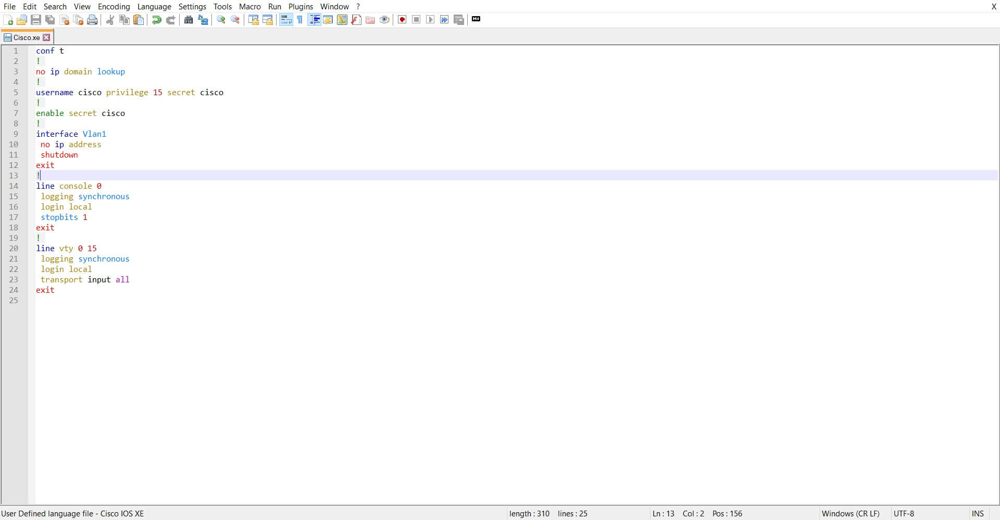

# Cisco IOS XR Commands Syntax Highlighting

<br />


<br />

> **This is an enhanced version of the UDL made by LuisPisco. His UDL can be found [here](https://github.com/notepad-plus-plus/userDefinedLanguages/blob/master/UDLs/Cisco_IOS_byLuisPisco.xml).**

After Installing [NotePad++](https://notepad-plus-plus.org/downloads/), place the `xml` file within `%AppData%\Notepad++\userDefineLangs`, and restart NotePad++.

Files with extensions `.cisco`, `.ios`, `.xr`, `.log`, and `.txt` will automatically use this UDL as their default language.

To change this behavior, edit `Cisco_IOS_XR_byOsamaAbbas.udl.xml` file at the following line, remove `txt` from `ext` property, and restart NotePad++.

```xml
<UserLang name="Cisco IOS XR" ext="cisco ios xr log txt" udlVersion="3.0">
```

## Preview

